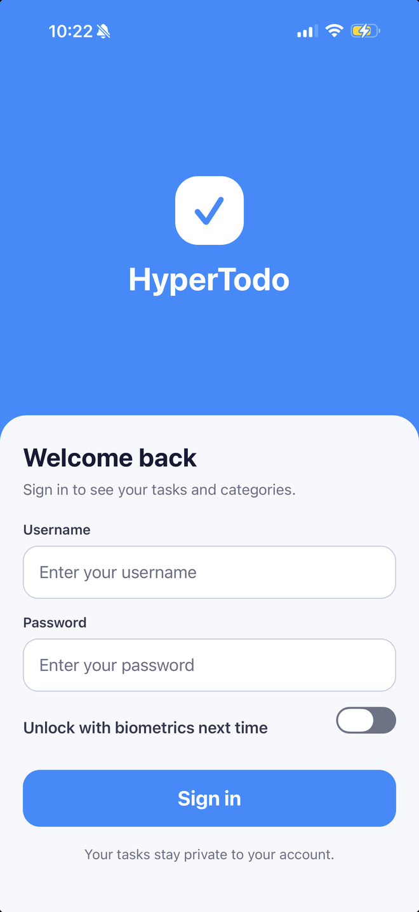
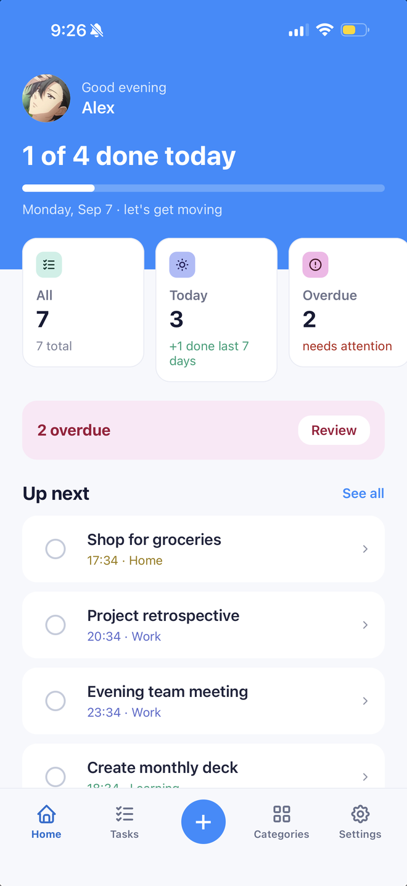
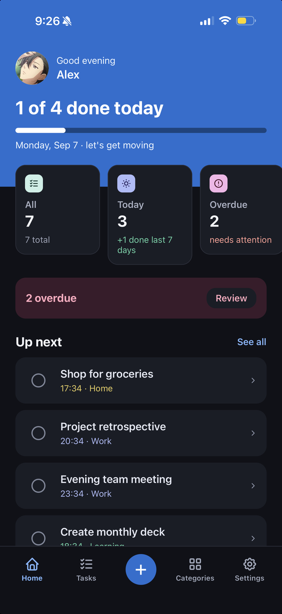
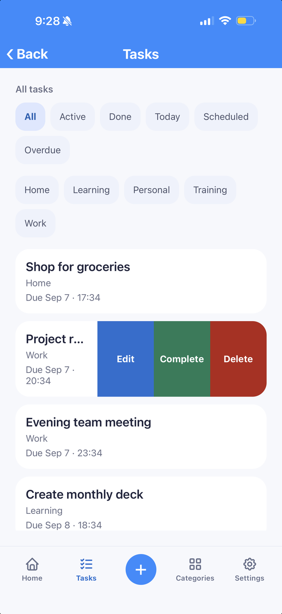
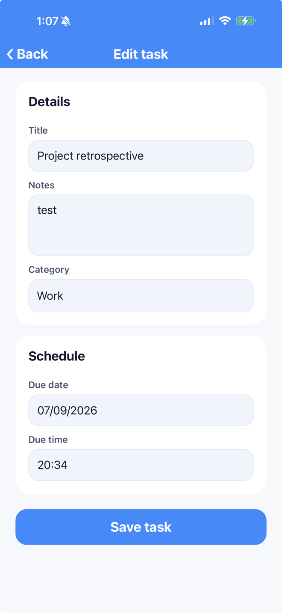
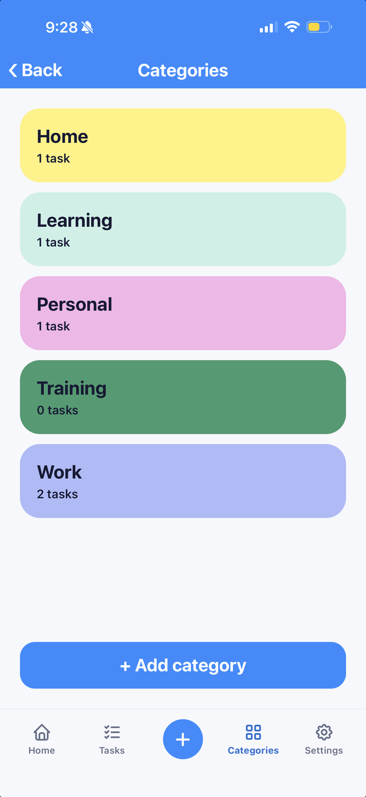
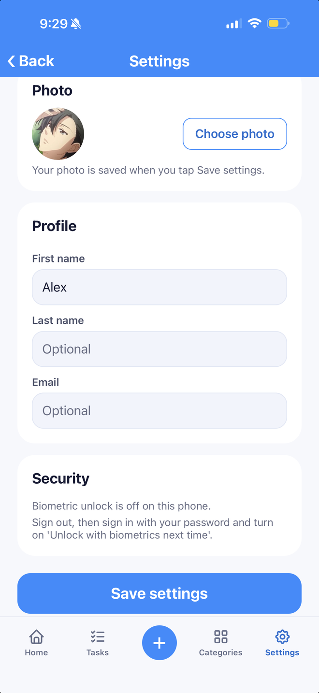
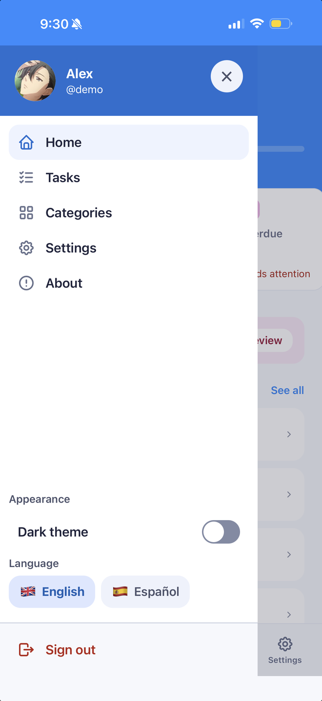
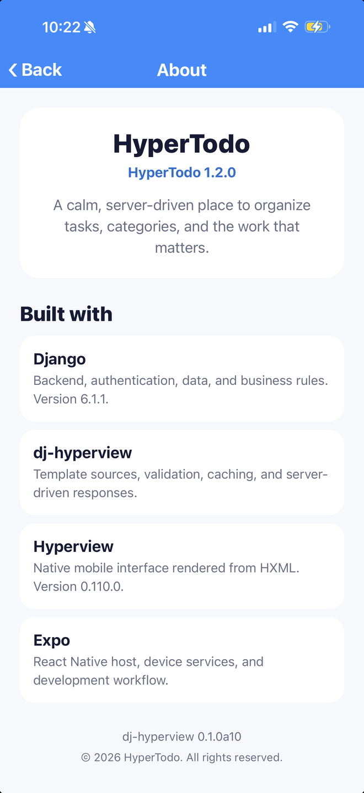
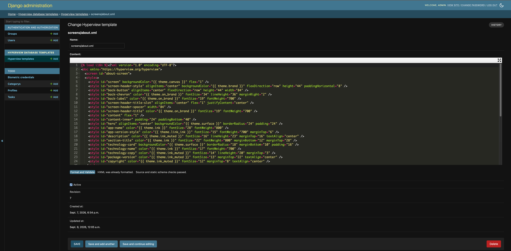

# HyperTodo

[](https://github.com/eamigo86/HyperTodo/actions/workflows/ci.yml)
[](https://pypi.org/project/dj-hyperview/0.1.0a19/)
[](https://www.npmjs.com/package/hyperview/v/0.110.0)
[](LICENSE)

HyperTodo is a test application for the
[dj-hyperview](https://github.com/eamigo86/dj-hyperview) package. It combines a
Django backend with an Expo mobile host that uses Hyperview to render native
screens from server-provided HXML.

The project exists to exercise dj-hyperview in a realistic application. It is
not intended to be a reusable task-management product.

## What HyperTodo tests

- Login and session authentication, with each user restricted to their own data.
- Task and category creation, editing, filtering, completion, and deletion.
- Complete HXML documents and partial screen updates with fragments.
- Filesystem templates and database-backed overrides edited through Django Admin.
- Template validation, source precedence, revision-based invalidation, and caching.
- Optional Redis caching with an isolated logical database and namespace.
- Light and dark themes, English and Spanish, avatars, and accessible contrast.
- Native integrations such as the animated splash screen, biometric unlock, image
  selection, swipe actions, and the side menu.
- Automated backend and mobile quality gates.

## Screenshots

<table>
  <tr>
    <td align="center"><br><strong>Login</strong></td>
    <td align="center"><br><strong>Light dashboard</strong></td>
    <td align="center"><br><strong>Dark dashboard</strong></td>
  </tr>
  <tr>
    <td align="center"><br><strong>Task actions</strong></td>
    <td align="center"><br><strong>Edit task</strong></td>
    <td align="center"><br><strong>Categories</strong></td>
  </tr>
  <tr>
    <td align="center"><br><strong>Settings</strong></td>
    <td align="center"><br><strong>Side menu</strong></td>
    <td align="center"><br><strong>About</strong></td>
  </tr>
</table>

## Repository layout

| Path | Purpose |
| --- | --- |
| `backend/` | Django 6.1.1 application using Python 3.14 and dj-hyperview 0.1.0a19. |
| `mobile/` | Expo 57 host using React Native 0.86 and Hyperview 0.110.0. |
| `Makefile` | Commands for installing, validating, and running both applications. |

## Quick start

### Requirements

- Python 3.14 and [uv](https://docs.astral.sh/uv/)
- Node 22.19.0 through [nvm](https://github.com/nvm-sh/nvm)
- Corepack
- Expo Go on a physical device, or an iOS/Android simulator
- Redis only when testing the optional shared-cache configuration

### 1. Prepare the project

Run these commands in a terminal opened at the repository root:

```console
make help
make setup
make backend-migrate
make backend-seed
make check
```

`make setup` installs the locked Python and JavaScript dependencies. The migration
command prepares the local database, and the seed command creates repeatable demo
data and publishes the database-template examples. `make check` verifies the
complete backend and mobile test suites before the app is started.

The development seed provides two local accounts:

| User | Password | Purpose |
| --- | --- | --- |
| `admin` | `admin123` | Superuser with access to Django Admin and the HXML editor. |
| `demo` | `demo123` | Regular user with separate tasks and categories. |

### 2. Start the backend for a physical device

First, obtain the development machine's LAN address from any root terminal:

```console
make lan-ip
```

Then start Django in the **backend terminal**, replacing the example address:

```console
LAN_IP=192.168.1.20 make backend-run-device
```

### 3. Start Expo Go

In a separate **mobile terminal**, use the same address:

```console
LAN_IP=192.168.1.20 make mobile-start-go
```

Scan the QR code with the phone camera and open the project in Expo Go. The phone
and development machine must be connected to the same reachable local network.

### Simulator alternatives

For an iOS Simulator, run `make backend-run` in the backend terminal and
`make mobile-start` in the mobile terminal. Use `make mobile-start-android` for
the Android Emulator. To exercise the existing Redis service, replace the backend
command with `make backend-run-redis`.

## Testing database-backed templates

The backend checks the database template source before the filesystem source.
`make backend-seed` publishes database overrides for the About screen and the
Categories document and fragment, while retaining their filesystem versions as
fallbacks.

1. Sign in to Django Admin with `admin` / `admin123`.
2. Open **Hyperview database templates → Hyperview templates**.
3. Edit and save the About template or a Categories template.
4. Return to the corresponding mobile screen and refresh it.

The About screen uses a database-backed template that can be edited and validated
in Django Admin, then refreshed immediately in the mobile application:



Editing stored HXML changes the mobile interface without rebuilding the app. Treat
that access like a production code-deployment permission: dj-hyperview restricts
template mutations to superusers by default.

## Quality checks

Run the complete automated gate from the repository root:

```console
make check
```

It runs Ruff, pytest with statement and branch coverage, Django system checks,
migration drift detection, TypeScript, Jest, and Expo Doctor. No native build is
required. Run `make acceptance` to print the manual device checklist.

Package documentation is available at
[eamigo86.github.io/dj-hyperview](https://eamigo86.github.io/dj-hyperview/).

## Automatic HXML validation

The installed dj-hyperview 0.1.0a19 release enforces one corrected Hyperview schema automatically.
HyperTodo configures only the extensions owned by its existing mobile host in
`backend/config/schema.py`: five custom behaviors and `image.variant` with
`face`/`fingerprint` values. `backend/schema/hypertodo.xsd` continues to describe
app-owned components through `EXTRA_SCHEMAS`. Empty biometric tokens remain valid
revocations, and fragment targets may reference their host document.

There is no schema profile, validation callback, or enable/disable flag to select.
The package owns standard validation and includes its schema dependency normally;
`[editor]` still enables the optional Admin editor. HyperTodo refuses startup when
the package lacks the `automatic-xsd-v1` capability. This is a compatibility check,
not a release number or a user setting: unsupported installations cannot silently
skip validation.

The package pin and lock are part of the same reviewed adoption. After pulling a
new version, run `make backend-install` before starting Django so the environment,
metadata, and automatic-validation contract cannot drift apart.

### What the corpus proves

The manifest covers all 39 filesystem XML sources: 12 documents, 21 fragments,
and 6 partials. Real route contexts exercise both themes and languages, empty and
populated data, absent/legacy/current mobile-version headers, successful and
invalid forms, authentication transitions, and escaped user text. Existing flow
tests use the same automatic rendered XSD contract as normal application requests. Active/inactive database overrides are
created only in isolated test databases.

Ten stylesheets moved intact inside their owning screen. Their byte hashes and
existing light palette goldens are unchanged; the pinned Hyperview stylesheet
parser is checked before/after relocation. Fragments remain bare and inherit
host styles. Language decorations now use one labeled button text with
role-neutral inline content, not unconverted boolean strings. The idle avatar
preview stays hidden with a transparent 1×1 PNG data URI: no missing/empty source
and no external request. The unchanged picker replaces its source before showing
it.

Admin **Format & Validate is context-free** and may report dynamic-template
warnings. It neither renders a scenario nor proves every rendered branch. The
before-save validator remains authoritative for its source-level contract;
rendered XSD validation is the separate runtime check. No preview is restored.
The corrected schema covers documented differences, not the whole native client:
date-field button labels are iOS-only, and the pinned host's decimal width
conversion (for example, `12.5` points becoming `12`) is not rewritten.

### Adopt database overrides explicitly

1. Obtain authorization for the exact database alias and take a verified backup.
   Run `check_hyperview_templates --database ALIAS` read-only. This checks identity
   integrity, **not XSD compatibility**. Stop on anomalies; do not choose a winner,
   delete duplicates, or repair automatically.
2. Review active rows before filesystem fallbacks, especially `screens/about.xml`,
   `screens/categories.xml`, and `fragments/category_list.xml`. `seed_demo` only
   creates absent rows and also changes demo accounts/data: **do not use it as an
   upgrade or repair command**.
3. Compare reviewed row contents with the normalized sources and validate them in
   an isolated copy using approved synthetic contexts. Preserve deliberate Admin
   edits; a filesystem-only green result does not authorize a package upgrade.
4. After human approval, publish each reviewed change through `publish_template`
   with the explicit alias and `expected_revision` from that review. A concurrent
   edit requires another review. Never perform automatic data migrations.
5. Adopt a reviewed package release and the matching consumer
   configuration **as one unit**, after the effective-source review passes. The
   package upgrade now activates enforcement; there is no later toggle. Update the
   pin/lock only as part of that authorized adoption and repeat installed-package
   acceptance before restarting the application. If any effective source still
   fails, keep the existing reviewed application/package pair in place.
6. Roll back the reviewed package and consumer configuration together, never by
   disabling validation. Database rollback requires its separate approved backup
   procedure; do not overwrite concurrent edits. Publication invalidates affected
   names. If a controlled repair requires namespace rotation, rotate only
   Hyperview's namespace—never flush a shared cache.

Visual comparison, native flows, and VoiceOver/TalkBack on **existing** iOS and
Android apps remain explicit manual acceptance gates. Check inline flag spacing,
spoken language/state, date controls, avatar picking, and fragment refreshes.
Automated source/prop tests are not device E2E evidence, and no new native build
or deployment is authorized by this guide.

## License

HyperTodo is distributed under the [MIT License](LICENSE).
